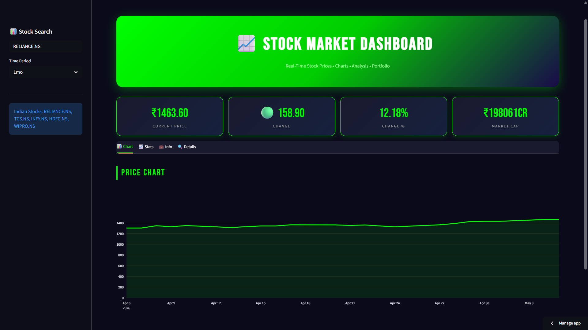

# Stock Market Dashboard 📈 | NSE/BSE Analytics

Real-time stock market dashboard built with Python + Streamlit. Track live stock prices, analyze charts, view company fundamentals, and monitor portfolio performance for Indian stocks.

### 🚀 Live Demo
**[Click Here to Launch Dashboard](https://stock-market-dashboard-lfc8hamsagalqxrjferi5f.streamlit.app/)** 

### 📸 Dashboard Preview


### 💹 Live Example - RELIANCE.NS
- **Current Price**: ₹1,463.60
- **Change**: +₹158.90 | **+12.18%** 
- **Market Cap**: ₹19,80,61 Cr
- **Sector**: Energy
- **Industry**: Oil & Gas Refining & Marketing

### 🔥 Key Features

**1. Stock Search**
- Search any NSE stock: RELIANCE.NS, TCS.NS, INFY.NS, HDFC.NS, WIPRO.NS
- Auto-suggestions for Indian stocks
- Time Period filters: 1d, 5d, 1mo, 6mo, 1y, 5y

**2. Chart Tab**
- Interactive candlestick charts with volume
- Moving averages: SMA 20, SMA 50, SMA 200
- Technical indicators: RSI, MACD

**3. Stats Tab**
- Key metrics: P/E Ratio, EPS, 52-Week High/Low
- Price change %, Market Cap, Volume

**4. Info Tab - Company Fundamentals**
- Sector, Industry, Website
- Dividend Yield, Employees count
- Business summary & financials

**5. Details Tab**
- Historical data table
- Download CSV for offline analysis

### 💡 Business Use Cases
1. **Retail Investors**: Track portfolio stocks in real-time
2. **Trend Analysis**: Identify breakout stocks using 1mo/6mo charts
3. **Fundamental Research**: Compare P/E, Dividend Yield before investing
4. **Sector Analysis**: Filter Energy, IT, Banking stocks separately

### 🛠️ Tech Stack
- **Frontend**: Streamlit
- **Data Source**: yfinance API for NSE/BSE real-time data
- **Visualization**: Plotly for interactive candlestick charts
- **Data Processing**: Pandas, NumPy
- **Deployment**: Streamlit Community Cloud

### 💻 Run Locally
```bash
git clone https://github.com/akash1234-design/stock-market-dashboard
cd stock-market-dashboard
pip install -r requirements.txt
streamlit run app.py
